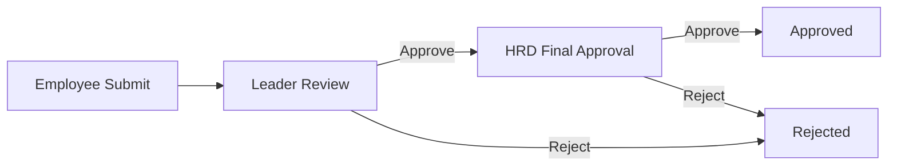
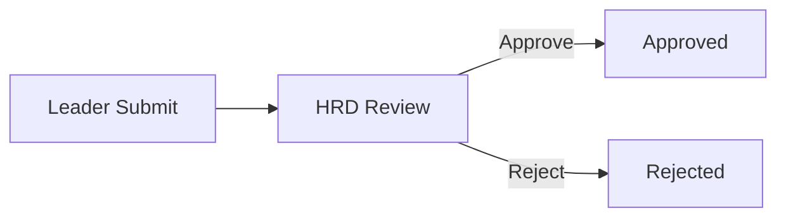

# 🏢 Sistem Manajemen Cuti Karyawan
> Sistem digitalisasi proses pengajuan, verifikasi, dan persetujuan cuti karyawan berbasis web menggunakan Laravel.

## 🎯 Overview
Sistem Manajemen Cuti Karyawan adalah aplikasi web yang dirancang untuk **mengotomatisasi dan mendigitalisasi** proses pengajuan cuti karyawan. Sistem ini mengelola seluruh alur persetujuan dari karyawan → ketua divisi → HRD dengan interface yang modern dan user-friendly.

### ✨ Highlight
- ✅ **Multi-level Approval**: Alur persetujuan bertingkat (Employee → Leader → HRD)
- ✅ **Dual Leave Types**: Cuti Tahunan (12 hari/tahun) & Cuti Sakit (dengan surat dokter)
- ✅ **Automatic Quota Management**: Perhitungan kuota otomatis (exclude weekend)
- ✅ **Real-time Validation**: Validasi overlap, kuota, dan eligibility
- ✅ **Auto PDF Generation**: Generate surat permohonan (untuk cuti tahunan) & surat izin cuti (untuk semua jenis cuti) otomatis
- ✅ **Document Management**: Upload surat dokter & download surat resmi (PDF)
- ✅ **Responsive Design**: Mobile-friendly dengan Tailwind CSS
- ✅ **Role-based Access Control**: 4 level user (Admin, Employee, Leader, HRD)

---

## 🚀 Fitur Utama

### 1️⃣ **Admin Dashboard**
- 📊 Manajemen Pengguna (CRUD users)
- 🏢 Manajemen Divisi & Anggota
- 📈 Dashboard statistik lengkap
- 🔍 Filter & Sort multi-parameter
- 👥 Track karyawan baru (< 1 tahun)

### 2️⃣ **Employee Features**
- 📝 Pengajuan Cuti Tahunan & Cuti Sakit
- 📊 Monitoring sisa kuota real-time
- 📄 **Auto-generate surat permohonan cuti** (cuti tahunan)
- 📄 **Download surat izin cuti** (setelah approved oleh HRD)
- ❌ Pembatalan pengajuan (status pending)

### 3️⃣ **Leader Features**
- ✅ Approve/Reject pengajuan anggota divisi
- 📝 Pengajuan cuti pribadi (langsung ke HRD)
- 👥 Dashboard anggota divisi
- 📊 Monitoring cuti tim

### 4️⃣ **HRD Features**
- ✅ Final approval semua pengajuan
- 📋 Batch approval (multiple selection)
- 📊 History cuti 
- 📄 Generate surat izin cuti otomatis


## 📦 Persyaratan Sistem

- PHP >= 8.2
- Composer >= 2.5
- MySQL >= 8.0 
- Node.js >= 18.x & NPM >= 9.x
- Git
- Web Server (Apache/Nginx)

---

## 💻 Instalasi

### 1️⃣ Clone Repository

```bash
git clone https://github.com/AndiErynNurAlisya/employee-leave-system.git
cd employee-leave-system
```

### 2️⃣ Install Dependencies

```bash
# Install PHP dependencies
composer install

# Install Node dependencies
npm install

# Instal DomPDF untuk PDF Generation
composer require barryvdh/laravel-dompdf
```

### 3️⃣ Environment Setup

```bash
# Copy .env.example
cp .env.example .env

# Generate application key
php artisan key:generate
```

### 4️⃣ Database Configuration

Edit file `.env`:

```env
DB_CONNECTION=mysql
DB_HOST=127.0.0.1
DB_PORT=3306
DB_DATABASE=leave_system
DB_USERNAME=root
DB_PASSWORD=your_password
```

### 5️⃣ Run Migration & Seeder

```bash
# Run migrations
php artisan migrate

# Seed database (optional - creates dummy data)
php artisan db:seed

# Or run both at once
php artisan migrate:fresh --seed
```

### 6️⃣ Storage Link

```bash
# Create symbolic link for file storage
php artisan storage:link
```

### 7️⃣ Build Assets

```bash
# Development
npm run dev

# Production
npm run build
```

### 8️⃣ Run Application

```bash
# Development server
php artisan serve

# Access: http://localhost:8000
```

---

## 👥 User Roles

### 1. **Admin** 
**Akses Penuh:**
- ✅ Manajemen pengguna 
- ✅ Manajemen divisi
- ✅ Konfigurasi sistem
- ✅ View all statistics

**Dashboard:**
- Total karyawan aktif/nonaktif
- Total divisi
- Pengajuan cuti bulan ini
- Karyawan baru (< 1 tahun)
- Pengajuan cuti terbaru

---

### 2. **Employee (Karyawan)**
**Dapat:**
- ✅ Mengajukan cuti tahunan & cuti sakit
- ✅ Melihat sisa kuota
- ✅ Membatalkan cuti (status pending)
- ✅ Download surat izin cuti
- ✅ Update profil pribadi

**Dashboard:**
- Sisa kuota cuti tahunan
- Total pengajuan cuti
- Riwayat Pengajuan cuti

**Syarat Cuti Tahunan:**
- ⚠️ Minimal masa kerja **1 tahun (12 bulan)** dan minimal **minimal H+3 sebelum cuti**

---

### 3. **Leader (Ketua Divisi)**
**Dapat:**
- ✅ Approve/Reject cuti bawahan (approval pertama)
- ✅ Mengajukan cuti pribadi (langsung ke HRD)
- ✅ Monitoring anggota divisi
- ✅ View statistik tim

**Dashboard:**
- Total pengajuan masuk
- Pending approval
- Daftar anggota divisi
- Anggota yang sedang cuti

**Alur Cuti Leader:**
- Leader → HRD (tanpa approval leader lain)

---

### 4. **HRD**
**Dapat:**
- ✅ Final approval semua pengajuan
- ✅ Batch approve/reject
- ✅ Generate surat izin cuti (PDF) otomatis
- ✅ Melihat History cuti

**Dashboard:**
- Total pengajuan bulan ini
- Pending final approval
- Karyawan yang sedang cuti
- History cuti
- Data divisi

---

## 🔄 Alur Sistem

### Alur 1: Employee → Leader → HRD



**Status Flow:**
1. `pending` → Menunggu approval leader
2. `approved_by_leader` → Disetujui leader, menunggu HRD
3. `approved` → Disetujui HRD (final)
4. `rejected` → Ditolak (bisa dari leader atau HRD)

---

### Alur 2: Leader → HRD



**Status Flow:**
1. `pending` → Menunggu approval HRD
2. `approved` → Disetujui HRD
3. `rejected` → Ditolak HRD

---

## 📅 Jenis Cuti

### 1️⃣ Cuti Tahunan (Annual Leave)

| Kriteria | Detail |
|----------|--------|
| **Kuota** | 12 hari kerja/tahun |
| **Perhitungan** | Exclude Sabtu & Minggu |
| **Pengajuan** | Minimal **H+3** sebelum tanggal mulai |
| **Eligibility** | Minimal masa kerja **1 tahun (12 bulan)** |
| **Dokumen** | Tidak perlu lampiran |
| **Kuota** | Dikembalikan jika dibatalkan/ditolak |
| **Auto-Generate** | ✅ **Surat Permohonan Cuti** (saat submit)<br>✅ **Surat Izin Cuti** (setelah approved HRD) |

**Validasi:**
- ✅ Sisa kuota mencukupi
- ✅ Tidak overlap dengan cuti lain
- ✅ Tanggal mulai ≥ H+3
- ✅ Masa kerja ≥ 12 bulan

**Dokumen yang Di-generate:**
1. **Surat Permohonan Cuti** (PDF) → Otomatis saat submit pengajuan
2. **Surat Izin Cuti** (PDF) → Otomatis setelah HRD approve

---

### 2️⃣ Cuti Sakit (Sick Leave)

| Kriteria | Detail |
|----------|--------|
| **Kuota** | Tidak mengurangi kuota tahunan |
| **Pengajuan** | Bisa **H-0** (hari ini) |
| **Dokumen** | **Wajib** surat keterangan dokter (upload) |
| **Format File** | PDF, JPG, JPEG, PNG |
| **Max Size** | 2MB |
| **Eligibility** | Semua karyawan (tanpa batasan masa kerja) |
| **Auto-Generate** | ✅ **Surat Izin Cuti** (setelah approved HRD) |

**Validasi:**
- ✅ Wajib upload surat dokter
- ✅ Format & size file valid
- ✅ Tidak overlap dengan cuti lain

**Dokumen yang Di-generate:**
1. **Surat Izin Cuti** (PDF) → Otomatis setelah HRD approve

---

## 🤝 Kontributor

- **Developer**: Andi Eryn Nur Alisya
- **Designer**: Andi Eryn Nur Alisya

</div>
